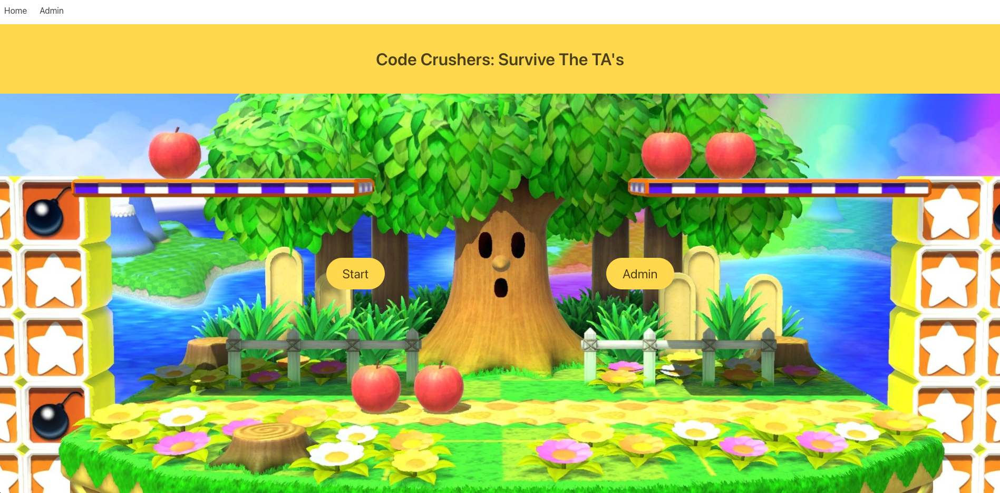
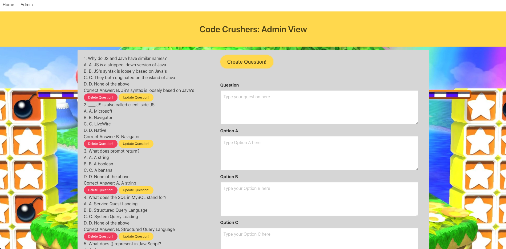
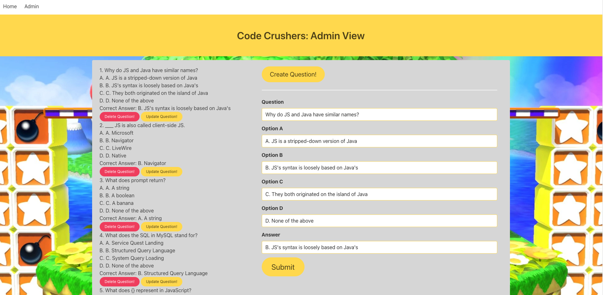
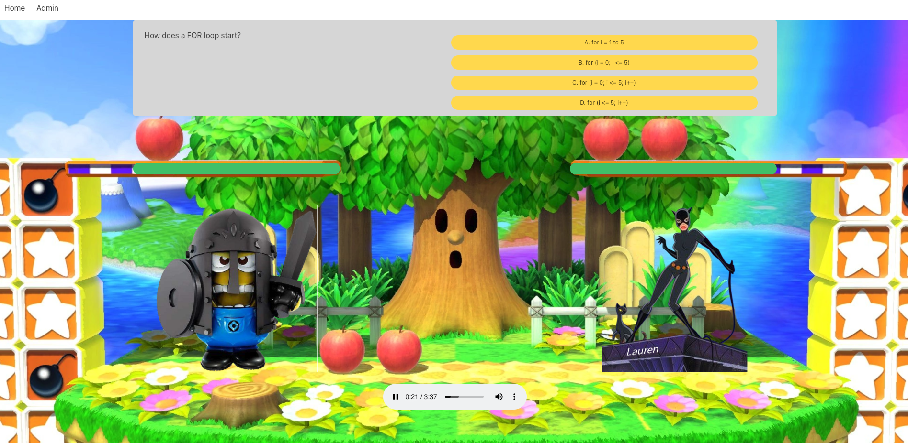

# project-two

Team Krypton's Code Crushers: Survive The TA's app

## Table of Contents

- [Description](#description)

- [Screenshots](#screenshots)

- [Acceptance-Criteria](#Acceptance-Criteria)

- [Installation](#installation)

- [Credits](#credits)

- [Contributing](#contributing)

- [Copyright](#copyright)

## Description

The purpose of this project was to create an application/coding game that prepares users for a job interview. The user battles TAs and eventually gets to the "Boss" Instructor. To progress through the game the user is asked a series of coding questions which if they answer wrong will remove 50 hit points from their overall health. If the user answers the question correctly they will hit the TA/Boss for 50 hit points. Once either the user or TA/Boss' health equals 0 then the game is over. From an administrative perspective, the admin is able to create, read, update and delete questions & answers from the associated database. Additional technologies that have been used are the Animate.css library and the incorporation of audio into the game. The ultimate desire for this application is to provide a fun and interesting way to learn more about full stack technologies while preparing for job interviews.

## Screenshots









## Acceptance-Criteria

```md
Must use a Node and Express web server

Must be backed by a MySQL database with a Sequelize ORM

Must have CRUD routes for at least one model

Must be deployed using Heroku (with data)

Must utilize at least one new library, package, or technology that we haven't discussed

Must have a polished front end/UI - NOT Bootstrap

Must have a folder structure that meets the MVC paradigm

Must use Handlebars for server-side templating

Must meet good-quality coding standards (indentation, scoping, naming, etc.)

Must protect API keys in Node with environment variables
```

## Installation

To access this project you will need to visit our GitHub page and the "project-two" repository. After the repository is cloned/forked you can make edits to the project in your repository. Any questions should be directed to [Brian Hayes](), [Bhargava Patel](), [Harshanan Saddanathan](), or [David Brown](mailto:gatech55@gmail.com). The official project can be found here: [project-two](https://github.com/bhayes11/project-two). The Heroku site can be found here: [Code Crushers: Survive The TA's](https://limitless-bastion-03523.herokuapp.com/).

## Credits

© 2019 Trilogy Education Services, a 2U, Inc. brand. All Rights Reserved.
[GitLab-13-Homework](https://gt.bootcampcontent.com/GT-Coding-Boot-Camp/gt-inc-fsf-pt-08-2020-u-c/tree/master/13-MVC/02-Homework/Instructions)

Music
[Music Used](https://www.fesliyanstudios.com/royalty-free-music/downloads-c/action-music/9)

Animate.css Library
[Animate.css](https://animate.style/)

## Contributing

<span style="color:red">Update with team name and final commits number.</span>

| **Commits** | **Contributor** |
| 100 | [GaTech55](https://github.com/GaTech55)|
| 100 | [GaTech55](https://github.com/GaTech55)|
| 100 | [GaTech55](https://github.com/GaTech55)|
| 100 | [GaTech55](https://github.com/GaTech55)|

## Copyright

Copyright (c) 2020 Team Krypton.
